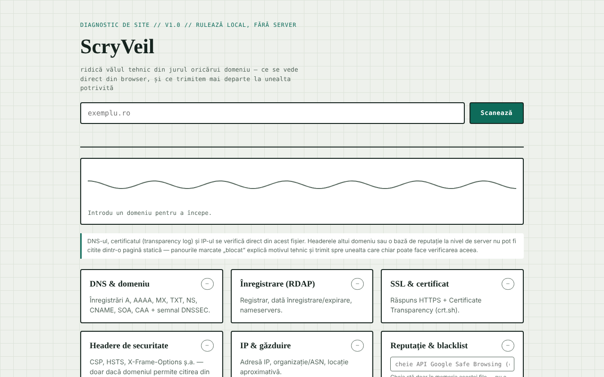

# ScryVeil

Diagnostic de securitate pentru orice site, rulat direct din browser: DNS, RDAP, certificat, headere, IP și reputație.

**Live:** https://chiuta.github.io/ScryVeil/

## Ce este

ScryVeil este o aplicație single-file (`index.html`) care „ridică vălul tehnic” din jurul unui domeniu: introduci un domeniu, iar pagina rulează din browser verificările posibile fără server propriu. Ce nu poate fi citit dintr-o pagină statică (headerele altui domeniu, baze de reputație la nivel de server) este marcat „blocat”, cu explicația tehnică și linkuri către unelte externe potrivite, cu domeniul completat automat.

## Funcții

Șase panouri:

- **DNS & domeniu** — înregistrări A, AAAA, MX, TXT, NS, CNAME, SOA, CAA și semnal DNSSEC.
- **Înregistrare (RDAP)** — registrar, dată înregistrare/expirare, nameservere.
- **SSL & certificat** — răspuns HTTPS și Certificate Transparency (crt.sh).
- **Headere de securitate** — CSP, HSTS, X-Frame-Options ș.a., doar dacă domeniul permite citirea din alt origin.
- **IP & găzduire** — adresă IP, organizație/ASN, locație aproximativă.
- **Reputație & blacklist** — verificare Google Safe Browsing dacă introduci opțional o cheie API proprie.

Plus „Trimiteri externe” (se deschid în filă nouă, cu domeniul completat): Sucuri SiteCheck, VirusTotal, Google Transparency, Qualys SSL Labs, securityheaders.com, Mozilla HTTP Observatory, Web-Check. Un indicator animat arată starea scanării. Interfața este în română.

## Manual de utilizare

1. Scrie domeniul în câmpul „exemplu.ro” (fără a fi nevoie de alte setări).
2. Apasă „Scanează”. Rezumatul de sub antet arată starea generală, iar fiecare panou primește o stare (ok / avertisment / problemă / blocat).
3. Citește fiecare panou; unde apare „blocat”, folosește linkul spre unealta externă din „Trimiteri externe”.
4. Opțional: pentru panoul de reputație, lipește o cheie API Google Safe Browsing în câmpul dedicat; cheia rămâne doar în memoria filei și nu este salvată.
5. Pentru alt domeniu, schimbă textul și apasă din nou „Scanează”.

## Confidențialitate și rețea

Aplicația **nu este offline**: verificările cer conexiune și contactează terți direct din browserul tău. Pagina însăși declară că nu trimite date către un server propriu și afișează, sub câmpul de scanare, ce date pleacă și către cine (nimic nu se trimite până nu apeși „Scanează”). Gazde contactate, la apăsarea „Scanează”:

- `dns.google` și `cloudflare-dns.com` (interogări DNS-over-HTTPS cu domeniul introdus);
- `rdap.org` (date de înregistrare);
- `crt.sh` (certificate transparency);
- domeniul verificat însuși, prin HTTPS (verificare de accesibilitate și, unde browserul permite, headere);
- `ipapi.co` (organizație/locație pentru IP-ul rezolvat);
- `safebrowsing.googleapis.com`, doar dacă introduci o cheie API.

Acești terți primesc domeniul introdus și adresa ta IP. Linkurile din „Trimiteri externe” se deschid doar la click. Nu am găsit în cod `localStorage`, `IndexedDB` sau cookie-uri; cheia Safe Browsing nu este persistată.

## Limitări și utilizare responsabilă

Verificările folosesc doar surse publice și cereri obișnuite din browser, dar rezultatele sunt informative și nu constituie un audit de securitate complet; „blocat” înseamnă că browserul (CORS) nu permite citirea, nu că problema nu există. Folosește instrumentul doar pentru domenii proprii sau pentru care ai acordul titularului.

## Rulare locală / offline

Descarcă `index.html` și deschide-l în browser. Interfața se încarcă fără internet, dar scanările necesită internet.

## Licență

Licența nu este încă declarată explicit în acest repository; vezi nota din aplicație. Aplicația nu conține o declarație de licență.

## Autor

Alexio — Alexandru-Ionuț Chiuță, contact: alexio@trom.tf.

## English summary

ScryVeil is a single-file browser-based site security checker: DNS records, RDAP registration data, certificate transparency, HTTPS/security headers (when readable), IP/hosting info and optional Google Safe Browsing lookups, plus links to external scanners. Requests go straight from your browser to public DNS (Google/Cloudflare), rdap.org, crt.sh, ipapi.co, the scanned domain and optionally Safe Browsing; nothing is stored. License not yet declared.

Audit: 2026-10-10 — verificat codul (gazdele contactate corespund secțiunii de mai sus; datele din răspunsuri sunt escapate sau inserate prin textContent), accesibilitatea (axe) și funcționarea; adăugat avertisment de utilizare.
